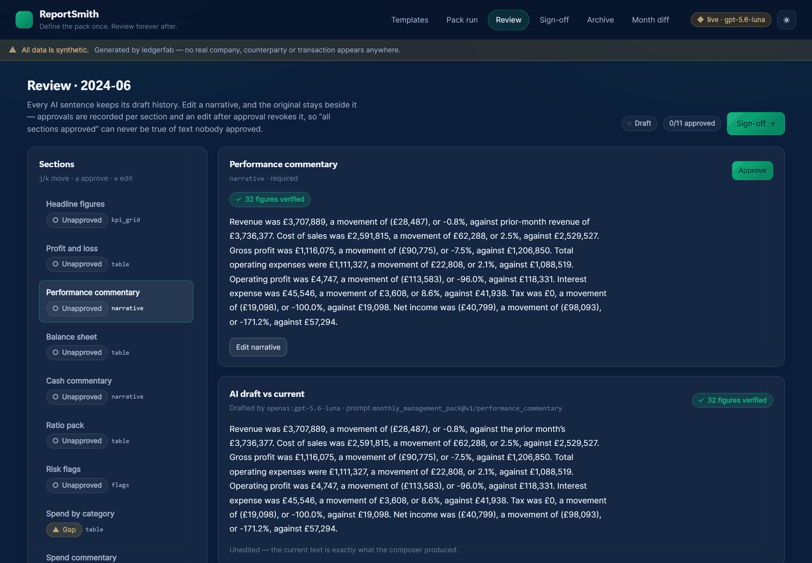

# ReportSmith

> **Define the pack once. Review forever after.**
> A governed reporting assistant: the monthly finance pack defined as a versioned template,
> assembled from live data each period, narrated by a model that cannot invent a number, and
> gated behind a human sign-off that records what was changed and what was waived.



**▶ [60-second demo](docs/demo.webm)** — the full governance flow, recorded by driving the
real app (`make record`). Assemble, review, edit with a tracked diff, watch it *refuse* to
issue, waive the gaps with a reason, sign, verify the archive, and diff against the next
month. The header badge in the recording reads `live · gpt-5.6-luna` — that is real model
output, every figure cross-checked.

<details>
<summary>The other five screens, in both themes</summary>

| | dark | light |
|---|---|---|
| **Templates** — YAML editor, validated as you type | [png](docs/screenshots/templates-dark.png) | [png](docs/screenshots/templates-light.png) |
| **Pack run** — binding status per section, gaps panel | [png](docs/screenshots/pack-run-dark.png) | [png](docs/screenshots/pack-run-light.png) |
| **Review** — tracked edits, figure chips | [png](docs/screenshots/review-dark.png) | [png](docs/screenshots/review-light.png) |
| **Sign-off** — the checklist, blocked on three gaps | [png](docs/screenshots/signoff-dark.png) | [png](docs/screenshots/signoff-light.png) |
| **Archive** — hashes and a live integrity check | [png](docs/screenshots/archive-dark.png) | [png](docs/screenshots/archive-light.png) |
| **Month diff** — identical structure, changed numbers | [png](docs/screenshots/month-diff-dark.png) | [png](docs/screenshots/month-diff-light.png) |
| **/aurora** — all nine spec 00 A2 components | [png](docs/screenshots/aurora-dark.png) | [png](docs/screenshots/aurora-light.png) |

These are produced by `make capture`, which does not just screenshot — it **fails** if a
screen renders empty, shows an error state, scrolls horizontally, logs a console error, or
is missing a claim the README makes about it. A screenshot of a broken page is worse than
no screenshot.

</details>

---

## The problem

Every finance team assembles the same pack every month: KPIs, a P&L and balance sheet
summary, ratio and risk review, category breakdowns, exceptions. Same sources, same format,
by hand, every time. The obvious fix — "get AI to write it" — fails on the thing that
matters: a board pack is a document somebody signs, and fluent commentary with an invented
figure in it is worse than no commentary at all.

ReportSmith takes the other route. The **pack is defined once**, as a versioned YAML
template. Each period it is assembled from live data; tables and KPIs are computed in code,
narratives are drafted from *that section's bound figures only*, and every number the model
writes is checked against those figures before it survives. Then a person reviews it, edits
what they want, approves section by section, and signs — and nothing is issued until they do.

---

## Architecture

```
                 ┌─────────────────────────────────────────────┐
  TEMPLATE  ────▶│  assemble/   tables · KPIs · flags           │  deterministic
  (YAML, versioned)  │  no LLM, golden-file tested             │  same data + template
                 └──────────────────┬──────────────────────────┘  = identical output
                                    │
   adapters/ ───────────────────────┤
   ├── ledgerfab      P&L · balance sheet · cash flow · exceptions
   ├── spendsort      category breakdown (real export schema)
   └── statementlens  ratios · red flags
        │
        └── missing or failed binding → explicit GAP, never a silent omission
                                    │
                 ┌──────────────────▼──────────────────────────┐
                 │  narrate/  (LangGraph)                      │
                 │  draft → numcheck → retry once → lint →     │
                 │  numcheck re-verify → finalize              │
                 └──────────────────┬──────────────────────────┘
                                    │
                 ┌──────────────────▼──────────────────────────┐
                 │  issue/  review · tracked edits · approvals │
                 │  sign-off · waivers · immutable archive     │
                 └─────────────────────────────────────────────┘

  [SPA · Vite + React + aurora]  ⇄  [FastAPI]  ⇄  [SQLite]
```

## What each sibling provides

This project **composes** rather than rebuilds. What that means concretely:

| From | What it provides | How |
|---|---|---|
| **`ledgerfab`** (spec 00 A3) | the synthetic world: invoices, GL, counterparties, payables exceptions | **vendored** — `backend/ledgerfab/`, zero local changes, drift-checked by a manifest |
| **`ledgerfab.statements`** (built in StatementLens) | multi-period **P&L, balance sheet and cash flow**, monthly grain, `Decimal`, derived from one trial balance so the statements cannot disagree | **vendored** with the engine; its own 169 tests run here |
| **SpendSort** (spec 11) | the categorised-spend export | adapter built against its **real** `COLUMNS`; fixtures generated by *running* SpendSort |
| **StatementLens** (spec 12) | ratio pack + red-flag rules | not yet built upstream (it is at P3 of P11), so computed **in-repo to its own P4/P5 shapes** |
| **`numcheck`** | the numeric cross-check | **originates here**, as a standalone package shaped to be lifted into StatementLens — see [`backend/numcheck/ORIGIN.md`](backend/numcheck/ORIGIN.md) |

Nothing imports across a sibling path at runtime. Reuse means vendored code with provenance
and schemas read from real source, never a path dependency that would make this repo
unclonable.

---

## ⚠️ All data is synthetic

Every figure in this repo — company, vendors, invoices, statements — is generated by
`ledgerfab` from a fixed seed. No real financial data is used anywhere, and the banner
saying so is visible on every screen and in every issued document.

---

## Governance: tracked edits and sign-off

This is the part to read if you only read one section. *"AI wrote our board pack"* is a
reasonable thing to be uncomfortable about, and the design is the answer:

**The model never calculates and never free-reads.** A narrative section receives that
section's bound figures and its tone rules. Nothing else — there is no parameter on the
composer through which the ledger, the other sections, or the raw world could arrive. The
isolation is structural, not a line in a prompt.

**Every number it writes is verified in code.** `numcheck` extracts each numeric token and
requires it to match a supplied figure *at the precision the model itself wrote*. Run live
against `gpt-5.6-luna`, **87 of 87 figures verified** — and when a section's tone rules asked
for a total the binding did not supply, the model *declined to invent it* rather than guess.
That was a bug in the template, and the fix was to supply the total, not to loosen the check. `£3.8m`
is checked to one decimal; `£3,815,070.61` to two. There is no tolerance setting, because a
tolerance setting is a knob, and a knob gets widened the first time a build goes red. A
mismatch triggers one re-draft; if it survives that, the offending **sentence is dropped** —
and the drop is recorded in the document, not just the database.

**The AI draft is preserved beside the human's text.** `ai_draft_json` is written once at
assembly and never again, so an edit cannot lose it. The Review screen shows a word-level
diff: green is what a person added, red is what they removed.

**Editing an approved section revokes its approval.** Otherwise "all sections approved"
could be true of text nobody approved — the one case where the guarantee matters.

**Unresolved gaps block issuance unless waived, and the waiver is recorded.** A waiver
without a reason is rejected: a waiver whose reason is unrecorded is indistinguishable from
nobody having looked. The signer, the reason and the gap all land in the archive.

**Issued archives are immutable.** Markdown, PDF, data snapshot and template version, under
one hash. `archives` is INSERT-only — a test greps the whole application to prove no UPDATE
or DELETE path exists — and the verifier re-hashes the files on disk and names which
artefact changed if one did.

---

## Quickstart

```bash
make install          # backend (uv) + frontend (npm)
make dev              # API on :8000, SPA on :5173
```

No API key needed. The LLM is **mocked by default**; the mock is deterministic, costs
nothing, and the header badge says so on every screen. Live drafting is
`REPORTSMITH_LLM=live` with `OPENAI_API_KEY` set.

On Windows, `./make.ps1 <target>` mirrors every Make target (there is no `make` on the box
this was built on — BLOCKERS **B1**).

### The demo

```bash
make demo             # both periods, end to end, then the month diff
```

```
2024-07  structure 596213ff41816fc3  values 39508803c9d278c3
2024-08  structure 596213ff41816fc3  values 04c58e9eb76c7a91
identical structure : True
changed numbers     : True
```

Same template, next period. Two hashes over deliberately disjoint inputs, so "identical
structure, changed numbers" is a claim a test can falsify rather than a look.

### Other targets

```bash
make test             # lint, typecheck, 383 backend tests, 38 frontend tests
make evals-gate       # the three CI gates, plus the self-test that proves a gate can fail
make capture          # screenshot AND verify all six screens, headless, both themes
make record           # re-record docs/demo.webm by driving the real app
make fixtures         # regenerate the SpendSort fixtures by RUNNING SpendSort
make golden           # regenerate the committed golden assembly files
```

---

## The template

Four section types, and no fifth. A closed declarative selector grammar for the bindings —
`where / group_by / aggregate / order_by / limit` — with no expression language anywhere.

```yaml
id: monthly_management_pack
version: 1

style:
  rounding:  { money: 0, percent: 1 }
  currency:  { code: GBP, symbol: "£", negative: parens }
  taboo_phrases: [significant, robust, leverage, world-class]
  max_sentence_words: 30

sections:
  - id: spend_by_category
    type: table
    required: true
    binding:
      source: spendsort
      select: categories
      order_by: ["-amount"]
      limit: 10
    columns:
      - { field: account_name, label: Category, align: left,  format: text }
      - { field: amount,       label: Spend,    align: right, format: money }
```

The fence is deliberate. An open-ended template language is how a reporting tool becomes a
programming language nobody can audit — and the closed grammar is also what makes
golden-file determinism achievable and a user-supplied YAML safe to accept.

See [`docs/TEMPLATE_GUIDE.md`](docs/TEMPLATE_GUIDE.md).

---

## Evals

`evals/` is the signature folder. Three gates, all green in CI, all in mock mode:

| Gate | What it asserts |
|---|---|
| **Numeric fidelity** | 100%, and a non-zero denominator — a composer cannot pass by writing nothing |
| **Gate self-test** | the deliberately faulty composer **must be caught**. A gate never seen red is not evidence |
| **State machine** | every (status × event) pair; cannot issue unapproved or unwaived-gapped packs |
| **E2E** | the default template on two periods, both issued, archives verified, diff correct |
| **Golden files** | assembly output byte-identical to the committed snapshots |

Plus `test_no_silent_omission.py`, which drives **twelve adversarial adapter behaviours** —
raising, returning `None`, wrong columns, wrong types, five thousand rows, unicode soup —
and asserts that in every case the pack still has exactly as many sections as the template.

---

## STATUS — honest

**Working end to end, on both paths.** `make demo` assembles, narrates, approves, waives,
signs, archives and diffs two periods. 383 backend tests, 38 frontend tests, all three eval
gates green, every screen verified headless in both themes — and the numeric-fidelity gate
now passes **against a real model** as well as the mock.

| Area | State |
|---|---|
| Template model, versioning, editor | ✅ complete |
| Adapters, selector grammar, gaps panel | ✅ complete |
| Assembly, golden files, month diff | ✅ complete |
| `numcheck` + composer + tone linter | ✅ complete; `numcheck` standalone and CI-tested without the app |
| Sign-off, tracked edits, waivers, archive + PDF | ✅ complete |
| Six screens, aurora, both themes | ✅ complete |
| **Live LLM path** | ✅ **run and measured** against `gpt-5.6-luna`: **87/87 figures verified, 100% fidelity**, one retry across twelve drafts, $0.0028 per pack. Evidence: `evals/results/fidelity-live-gpt-5.6-luna.json`. Mock remains the default and the only path CI runs |
| **StatementLens ratios/flags** | ⚠️ computed in-repo to upstream's P4/P5 shapes; the live swap is one reader change — BLOCKERS **B4** |
| **`numcheck` upstream** | ⚠️ belongs in StatementLens (its P6). If it writes its own, one of the two has to go — BLOCKERS **B4** |
| Screens verified headless, both themes | ✅ `make capture` — 7 screens × 2 themes, asserted, not just photographed |
| Demo video | ✅ `docs/demo.webm` — 60s, recorded from the real app via `make record`. Un-narrated; the voiceover script is `docs/DEMO_SCRIPT.md` |

Read [`BLOCKERS.md`](BLOCKERS.md) for the full list, including the Phase 0 mistake that
shaped a day of planning and how it was corrected.

---

## Documentation

[PLAN.md](PLAN.md) · [PROGRESS.md](PROGRESS.md) · [BLOCKERS.md](BLOCKERS.md) ·
[FINAL_REPORT.md](FINAL_REPORT.md) · [MODEL_COSTS.md](MODEL_COSTS.md) ·
[docs/TEMPLATE_GUIDE.md](docs/TEMPLATE_GUIDE.md) ·
[docs/ADAPTER_CONTRACTS.md](docs/ADAPTER_CONTRACTS.md) ·
[docs/GOVERNANCE.md](docs/GOVERNANCE.md)

MIT licensed. Built by an ex-accountant turned AI engineer.
